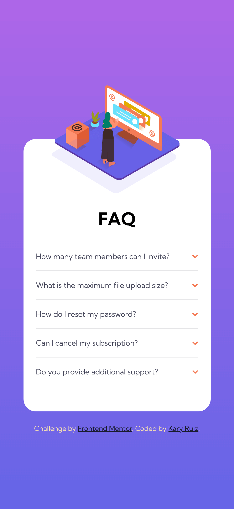
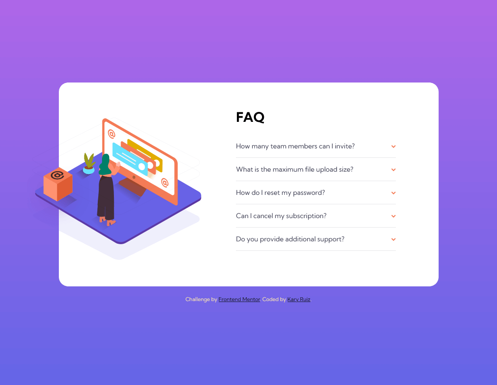

# Frontend Mentor - FAQ accordion card solution

This is a solution to the [FAQ accordion card challenge on Frontend Mentor](https://www.frontendmentor.io/challenges/faq-accordion-card-XlyjD0Oam). Frontend Mentor challenges help you improve your coding skills by building realistic projects. 

## Table of contents

- [Overview](#overview)
  - [The challenge](#the-challenge)
  - [Screenshot](#screenshot)
  - [Links](#links)
- [My process](#my-process)
  - [Built with](#built-with)
  - [What I learned](#what-i-learned)
  - [Continued development](#continued-development)
  - [Useful resources](#useful-resources)
- [Author](#author)

## Overview

### The challenge

Users should be able to:

- View the optimal layout for the component depending on their device's screen size
- See hover states for all interactive elements on the page
- Hide/Show the answer to a question when the question is clicked

### Screenshot




### Links

- Solution URL: [Solution URL here](https://www.frontendmentor.io/solutions/faq-accordion-card-challenge-hub-dRQzWUpK-)
- Live Site URL: [Github Pages URL here](https://kary01.github.io/challenge-faq-accordion-card/)

## My process

### Built with

- Semantic HTML5 markup
- CSS custom properties
- Flexbox
- CSS Grid
- Mobile-first workflow

### What I learned

With this practice, I use the details tag to Hide/Show the answer to a question when the question is clicked.

>The `<details>` HTML element creates a disclosure widget in which information is visible only when the widget is toggled into an "open" state. A summary or label must be provided using the `<summary>` element.

See below:

```html
<details>
	<summary>How many team members can I invite</summary>
	<p>You can invite up to 2 additional users on the Free plan. There is no limit on team members for the Premium plan.</p>
</details>
```
For the customization of the arrow I made use of the css pseudo-element `::marker`

>The `::marker` CSS pseudo-element selects the marker box of a list item, which typically contains a bullet or number. It works on any element or pseudo-element set to `display: list-item`, such as the `<li>` and `<summary>` elements.

See below:

```css
::marker {
  color: blue;
  font-size: 1.2em;
}
```

### Continued development


After this challenge, I think I have to practice with css pseudo-elements.

### Useful resources

- [details tag](https://developer.mozilla.org/en-US/docs/Web/HTML/Element/details) - MDN.
- [::marker](https://developer.mozilla.org/en-US/docs/Web/CSS/::marker) - MDN .

## Author

- Frontend Mentor - [@Kary01](https://www.frontendmentor.io/profile/Kary01)

